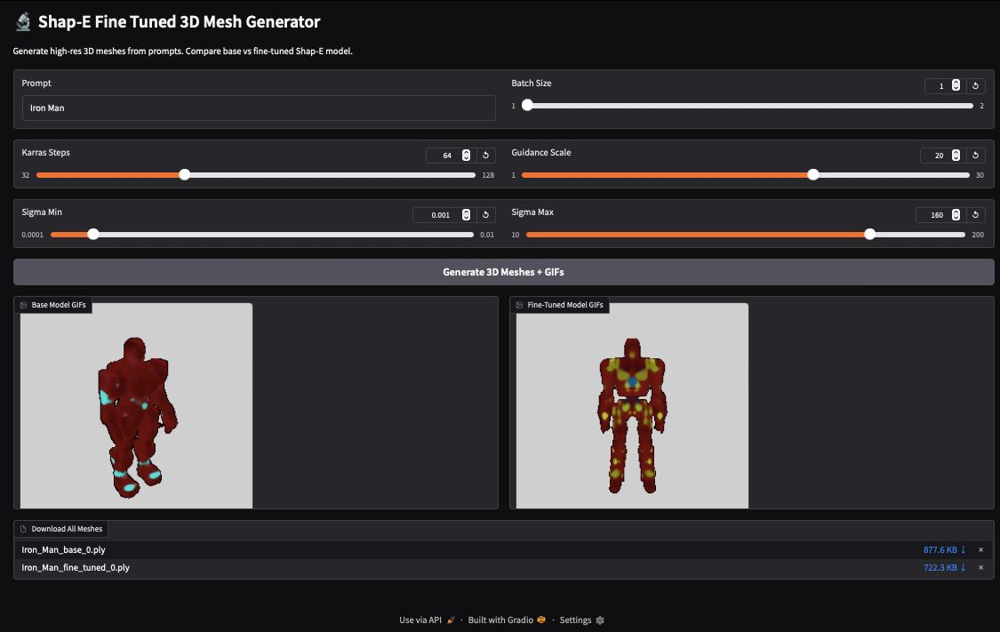
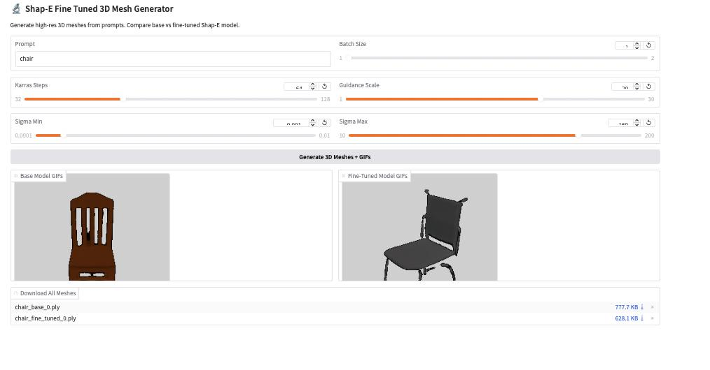
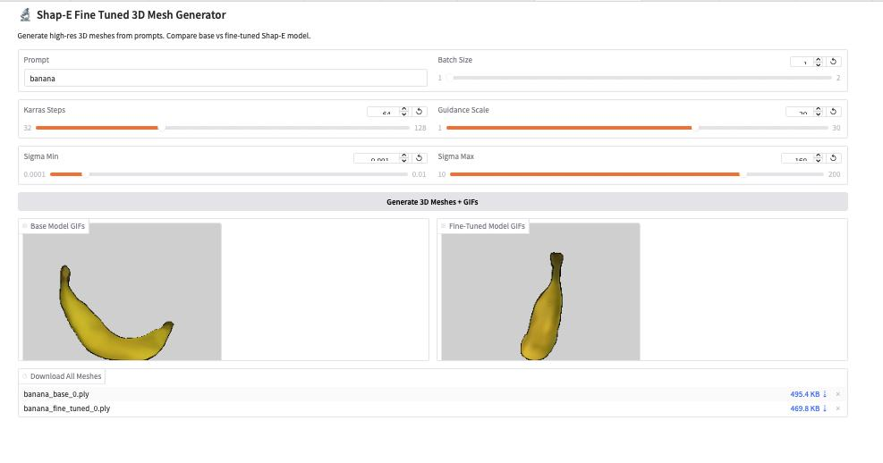

# Cap3D Text-to-3D Fine-Tuning

This repository contains code and resources for **Cap3D Text-to-3D Fine-Tuning**.
Due to the size of the models and datasets (greater than 1GB), **we are using Google Drive and Google Colab** instead of hosting them directly on GitHub or HuggingFace, since both platforms have limitations even with Git LFS.

## 📂 Resources

- **Google Drive Link (Models & Datasets):**  
  [Download from Google Drive](https://drive.google.com/file/d/1GQOZFfAMJ4parzt6Amjvy-5Wzqb5CpxC/view?usp=share_link)

- **Google Colab Notebook (Code & Execution):**  
  [Open Colab Notebook](https://colab.research.google.com/drive/1tjvLwHo2LO3KW7ulThWIEF1l3jft4G3j?usp=sharing)

## 🚀 Summary of the Notebook

1. **Clone Repository:** Clones the Cap3D GitHub repository.
2. **Setup Environment:** Checks Python version, installs required libraries like Gradio.
3. **Download Models:** Uses `gdown` to download large fine-tuned model files from Google Drive.
4. **Model Preparation:** Moves model checkpoints to appropriate folders and cleans up.
5. **Load Models:** Loads Shap-E pre-trained models (`text300M` and `transmitter`) and saves their state_dicts for comparison.
6.  **Load Fine-Tuned Models:** Loads Shap-E fine-tuned models (`fine_tuned_shape_with825kdata` and `transmitter`) and saves their state_dicts for comparison.
7. **Fine-tuning/Inference Setup:** Prepares configuration for sampling 3D meshes from text prompts.

## 🖥️ System Specifications Used

During development and testing, the following system setup was used:

- **CPU:** Intel Core i5 11th Gen
- **No. of Processors Assigned** 16 (Virtual Machine)
- **GPU:** NVIDIA RTX 3060 (12GB VRAM)
- **RAM:** 32GB DDR4
- **Storage:** 512GB NVMe SSD
- **Operating System:** Ubuntu 22.04 LTS (Running on Virtual Machine)
- **Python Version:** 3.10

> **Note:** Although training on this setup was possible, for large-scale training and faster results, higher-end GPUs and more RAM are recommended.

## Dataset Link
https://huggingface.co/datasets/tiange/Cap3D/tree/main/misc/ShapELatentCode_zips

## 📢 Download Additional Data from HuggingFace

Install Hugging Face libraries:
```bash
pip install huggingface_hub
```

Download one file manually:
```bash
huggingface-cli download tiange/Cap3D --repo-type dataset misc/ShapELatentCode_zips/compressed_code_00.zip
```

Download multiple files programmatically:
```python
import os
from huggingface_hub import hf_hub_download

# Define repo details
repo_id = "tiange/Cap3D"
repo_type = "dataset"
base_dir = "misc/ShapELatentCode_zips"
local_dir = "./example_material/Cap3D_latentcodes"

# Create the local target directory if it doesn't exist
os.makedirs(local_dir, exist_ok=True)

# List of known zip files (you can expand this list as needed)
filenames = [
    f"{base_dir}/compressed_code_{i:02d}.zip" for i in range(20)
]

# Download loop
for filename in filenames:
    print(f"Downloading {filename}...")
    file_path = hf_hub_download(repo_id=repo_id, filename=filename, repo_type=repo_type, local_dir=local_dir)
    print(f"Saved to {file_path}")

print("✅ All downloads completed.")
```


## 📰 Screenshots

| Screenshot 1 | Screenshot 2 | Screenshot 3 |
|:------------:|:------------:|:------------:|
|  |  |  |

## ⚠️ Note
- Ensure sufficient free space in your Google Drive if you copy the resources.
> **Note:**
> .zip $x \approx y$ 6.5GB
> Total file - dataset : $x \approx y$ 8.9GB
> Dataset(Complete) $x \approx y$ 2.49 TB
> Dataser(Used) $x \approx y$ 9.3 GB (2 Latents of 4.5GB)
---

Feel free to open an issue if you face any problems!

